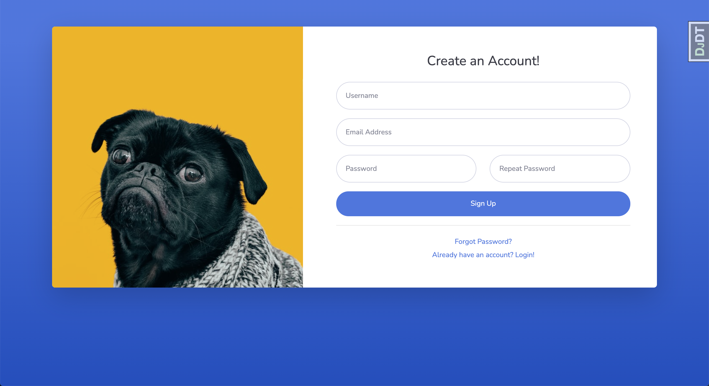
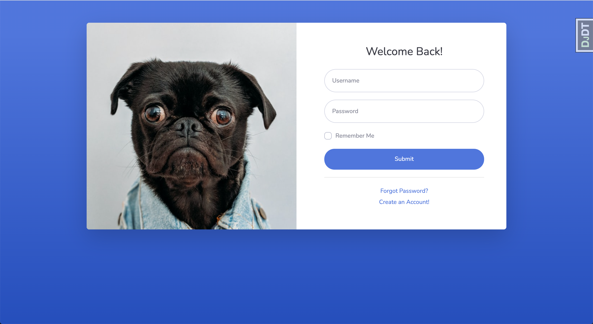
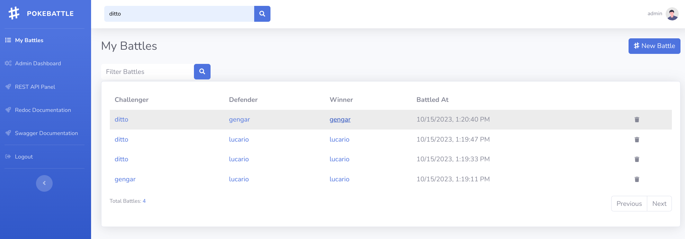
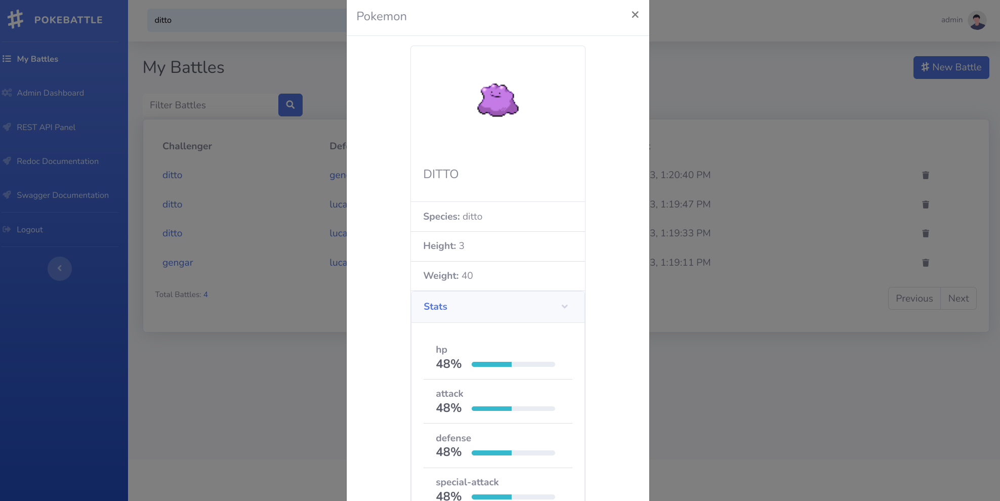
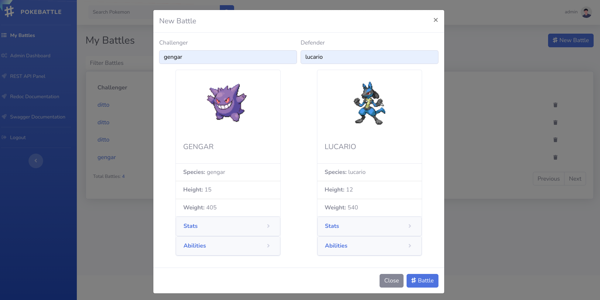
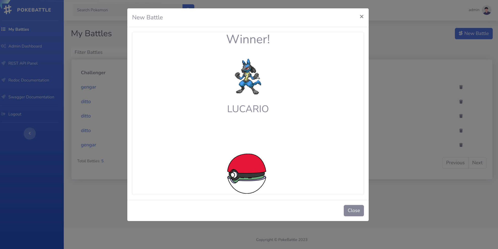

# PokeBattle

A simple application to create and manage pokebattle with REST API!

## API
- Rest API Root: [http://localhost:8000/api/](http://localhost:8000/api/)
- Swagger Documentation: [http://localhost:8000/swagger/](http://localhost:8000/swagger/)
- Redoc Documentation: [http://localhost:8000/redoc/](http://localhost:8000/redoc/)
- You can go to the API Root from browser and browse through all available APIs.

### API Authentication
This app use http token authentication to authenticate an user. To use any APIs you have to send authentication token in the http header.
- Ssend a post request with username and password to [http://localhost:8000/token-auth/](http://localhost:8000/token-auth/), you will get authentication token in response. 
- Add the authentication token on the header of your subsequent API calls as bearer token to authenticate yourself.

## Resources
This app leverages the following resources, but you don't need to worry about installing and configuring most of these. Just see prerequisites below for what you need on your machine to make this work:

  - [Docker](https://www.docker.com/) - for virtual development environment and easy deployment
  - [Django](https://www.djangoproject.com/) - Python-based web framework
  - [DRF](https://www.django-rest-framework.org/) - A powerful and flexible toolkit for building Web APIs.
  - [VUE](https://vuejs.org/) - The Progressive JavaScript Framework.
  - [PostgreSQL](https://www.postgresql.org/) - A powerful, open source object-relational database system.
  - [Allauth](https://github.com/pennersr/django-allauth) - for user authentication
  - [sbadmin2](https://startbootstrap.com/theme/sb-admin-2) - A Free Bootstrap Template from [Start Bootstrap](https://startbootstrap.com/).

## Prerequisites
As a prerequisite please make sure you have the following tools already installed on your machine:
1. [Git](https://git-scm.com/)
2. [Docker](https://docs.docker.com/get-docker/)
3. [Docker Compose](https://docs.docker.com/compose/install/)

## Setup in under 5 minutes!
1. Clone this repo
```sh
git clone git@github.com:alihasanimam/pokebattle.git
```

2. Build the Docker Container
```sh
cd pokebattle
docker-compose up --build
```
You should see all the resources including the web server startup in your terminal. When everything is complete, press `Ctrl+C` to exit from docker-compose.

3. Populate Postgres DB
```sh
docker-compose exec web python manage.py migrate
```

4. Seed initial data from fixutres (optional)
```sh
docker-compose exec web python manage.py loaddata user/fixtures/*
```

## Demo
Lunch the application
```sh
docker-compose up
```
Now go to [localhost:8000/](http://localhost:8000/). That should be enough for you to run the project locally.
- Website: [http://localhost:8000/](http://localhost:8000/)
- Default Admin: `username: admin, password: adminadmin`
- Default User: `username: user, password: useruser`

## Screenshots
Here is what your app should look like when you visit `localhost:8000`.

With this app you can:

1. Create an account.


2. Login to an existing account if you've already created one.


3. View your battle history. You can filter battles and delete any battle from the history.


4. You can search any pokemon by its name.


5. You can do a battle with two pokemons.


6. After a battle, the app will show the winner and a record will be added in the battle history.


## Helpful Docker + Django Commands ##
```sh
# rebuild docker container
docker build .
# start docker container
docker-compose up
# shutdown docker-container
docker-compose down


# generate db migrations
docker-compose exec web python manage.py makemigrations
# run db migrations
docker-compose exec web python manage.py migrate
# start new app
docker-compose exec web python manage.py startapp <app name>
# shell into docker container
docker-compose exec web python manage.py shell

```